  

  
  
  

 

## Currently

Building ETL streaming and transformation on **Confluent** for **Bank Indonesia** — change data capture into Kafka, stream processing on top, analytics downstream.

Before that: microservices for **BNI** core system integration, and a Super Apps platform on Next.js with the Google Maps API.

 

## Selected work

<table>
<tr>
<td width="50%" valign="top">

### ⚡ Tiered Storage, explained

Interactive documentation for Kafka tiered-storage architecture — animated flow diagrams and draggable nodes. Written as a working reference for on-premise Confluent + MinIO deployments.

[**Open the docs →**](https://github.com/Octopuzzz/teired-storage-confluent)

</td>
<td width="50%" valign="top">

### 🎨 irennieart.com

Next.js site for an illustration studio: portfolio galleries, art-class booking, and a contact API route. Designed, built and shipped end to end.

[**Visit the site →**](https://www.irennieart.com)

</td>
</tr>
</table>

 

## Toolchain

**Languages**

  
  
  
  
  

**Streaming &amp; data**

  
  
  
  

**Backend**

  
  
  
  

**Frontend**

  
  
  
  

**Infrastructure**

  
  
  
  
  

 

## Certifications

`IBM Certified App Connect Enterprise` · `MongoDB SI Associate` · `Kominfo Digitalent — Go, React, Ruby on Rails`

 

## Activity

  
  

  

<!--
  The hero is a single self-contained SVG at assets/hero.svg — edit the text
  directly in that file. GitHub strips CSS from markdown, so the gradients and
  the pipeline animation have to live inside the SVG, not here.

  GitHub caches images through its camo proxy. If an edit doesn't show up,
  hard-refresh or bump the version: 
-->
