  

  
  
  

---

### `+ FEATURED`

**[`⚡ teired-storage-confluent`](https://github.com/Octopuzzz/teired-storage-confluent)**
Interactive documentation for Kafka tiered-storage architecture — animated flow diagrams and draggable nodes. Written as a technical reference for on-premise Confluent + MinIO deployments.

**[`glammcom-seo`](https://github.com/Octopuzzz/glammcom-seo)**
TypeScript SEO tooling.

  
  

---

### `+ TOOLCHAIN`

  
  
  
  
   
  
  
  
  
   
  
  
  
  

---

### `+ TELEMETRY`

  

  

  

---

Dossier card is generated, not hand-edited — run <code>python3 tools/build_card.py</code> after changing
<code>CONTENT</code> in that file. Portrait comes from <code>tools/ascii_portrait.py</code>.

<!--
  Regenerating the card:
    python3 tools/ascii_portrait.py --image avatar.png > tools/portrait.json
    python3 tools/build_card.py

  GitHub caches images through its camo proxy, so an updated SVG can take a few
  minutes to appear. Force it by hard-refreshing, or bump the ?v= number below:
    
-->
